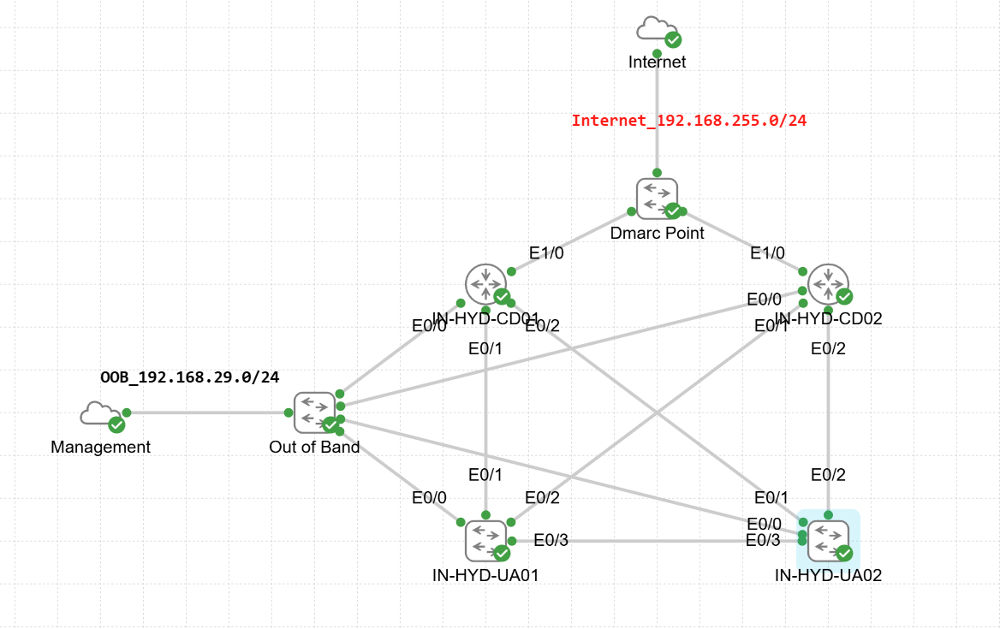

# Sample Topology Test (CML)

### Topology Overview

This lab simulates a basic enterprise/DC-style network with:
- Dual core routers
- User access layer
- Out-of-band (OOB) management
- Internet/DMARC connectivity

It is designed to validate Cisco IOS automation playbooks for connectivity, management access, and routing reachability.

### Logical Segments
| Segment        | Subnet             | Purpose                               |
| -------------- | ------------------ | ------------------------------------- |
| OOB Management | `192.168.29.0/24`  | Device management & automation access |
| Internet       | `192.168.255.0/24` | External connectivity via DMARC       |
| Internal Links | P2P                | Core ↔ Access connectivity            |

### Devices Used

| Device             | Role                        |
| ------------------ | --------------------------- |
| DMARC Point        | Internet edge router        |
| IN-HYD-CD01 / CD02 | Core / Distribution routers |
| IN-HYD-UA01 / UA02 | User / Access switches      |
| Out-of-Band        | Management aggregation      |
